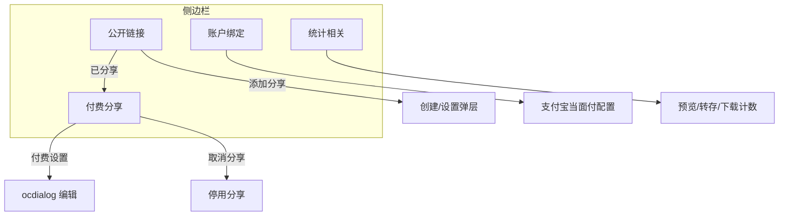

# ShareGate WebUI — 总体规划设计（2026-06 修订）

> 应用入口：Nextcloud 顶部导航 **ShareGate** → `/apps/sharegate/`  
> 左侧栏：NC 全局 `#app-navigation`（`RegisterNavigationListener` 注册四项，非页面内自建）  
> 关联：[BACKLOG.md](BACKLOG.md)（实施清单）· [DASHBOARD.md](DASHBOARD.md)（将实现细节）

---

## 1. 设计目标

| 目标 | 说明 |
|------|------|
| **卖家一站式** | 在 ShareGate App 内完成：选文件 → 开付费分享 → 管链接 → 绑收款 → 看数据 |
| **与 NC 一致** | 默认 layout、侧栏 + 主区、`button` / 表格 / `settings-hint`；设置用 `ocdialog` |
| **概念清晰** | **公开链接** = 以 **文件** 为中心；**付费分享** = 以 **已创建的分享** 为中心；二者不混表 |
| **不做 Files 右键** | 「添加分享」在公开链接表内完成，等价于原计划的 Files 集成 |

---

## 2. 信息架构（IA）

```
付费分享 App
├── 侧边栏（4 项，互斥主视图）
│   ├── 公开链接      → 文件列表 + 是否已开付费分享
│   ├── 付费分享      → 已开分享的管理表
│   ├── 账户绑定      → 收款账户（支付宝当面付等）
│   └── 统计相关      → 按文件的访问/转化数据
└── 全局
    ├── 顶部 NC 导航（不变）
    └── 弹层：付费设置（价格、有效期等）、创建分享（从「添加分享」进入）
```



---

## 3. 整体布局线框

```
┌──────────────────────────────────────────────────────────────┐
│  Nextcloud 顶部导航 (文件 | 照片 | ... | [付费分享])            │
├──────────────────────────────────────────────────────────────┤
│  ┌──────────────────┐  ┌───────────────────────────────────┐ │
│  │ NC 全局左侧栏     │  │  #app-content 主区                 │ │
│  │ 公开链接          │  │  [搜索]  （+ 创建链接 仅部分页）   │ │
│  │ 付费分享          │  ├───────────────────────────────────┤ │
│  │ 账户绑定          │  │  当前页表格 / 表单（见 §4）          │ │
│  │ 统计相关          │  │                                   │ │
│  └──────────────────┘  └───────────────────────────────────┘ │
└──────────────────────────────────────────────────────────────┘
```

**侧栏规则**

- 四项 **平级**，无二级筛选（取消旧版「所有公开链接 / 已启用付费」双列表筛选）。
- 角标（可选二期）：公开链接 = 未开分享的文件数；付费分享 = 有效分享数；统计 = 有数据的分享数。
- 切换侧栏项时切换 **整页主内容**，不保留上一页滚动位置。

---

## 4. 分页面设计

### 4.1 公开链接

**定位**：卖家浏览 **自己网盘里的文件**，并一眼看到是否已开付费分享。是 **获客入口**（添加分享），不是已开分享的运维表。

**主内容：表格**

| 列 | 字段 | 说明 |
|----|------|------|
| 名称 | `file_name` | NC 文件名，可带图标 |
| 大小 | `file_size` | 人类可读（300 KB） |
| 修改日期 | `mtime` | 相对时间（6 天前）或绝对日期 |
| 付费分享 | 操作 | **已分享**（链接到付费分享页/高亮该行）或 **添加分享**（打开创建流程） |

**示例**

```
名称                    | 大小   | 修改日期 | 付费分享
Nextcloud Manual.pdf   | 300k   | 6天前    | 已分享
test.pdf               | 600k   | 6天前    | 添加分享
```

**交互**

| 操作 | 行为 |
|------|------|
| **添加分享** | 打开创建弹层（或向导），预填 `file_path`、`file_name`、`file_size`；成功后该行变为「已分享」 |
| **已分享** | 跳转侧栏「付费分享」并定位该条，或打开付费设置弹层 |
| 搜索 | 按文件名过滤（NC 用户目录内） |

**数据来源**

- 文件列表：`IRootFolder::getUserFolder($uid)` 遍历或分页查询（**仅文件**，不含文件夹，或文件夹折叠二期）。
- 分享状态：左连接 `sharegate_shares`（`created_by` + `file_path`/`file_id` 匹配，**有效** `status=active` 且未过期）。

**工具栏**（对齐 §5.2）

- `[搜索]`：文件名（`NcAppNavigationSearch`）。
- 面包屑 ▼ 下拉、**类型**、**修改日期**、**分享状态**、**网格/列表**。
- 无顶部「创建链接」；行内「添加分享」打开 `CreateShareSidebar`。

---

### 4.2 付费分享

**定位**：已创建的 **ShareGate 付费外链** 运维表；卖家日常管理复制链接、改价、取消分享。

**主内容：表格**

| 列 | 字段 | 说明 |
|----|------|------|
| 名称 | `file_name` 或 `title` | 以文件名为准（与线框一致） |
| 复制链接 | 操作 | 一键复制 `share_url` |
| 分享时间 | `created_at` | 格式 `YYYY/M/D` |
| 定价 | `price` | 元（分→元） |
| 付费设置 | 操作 | 按钮 **编辑** → `ocdialog` 付费设置（价、授权天数、链接有效期） |
| （末列） | 操作 | **取消分享** → 停用 `status=disabled`（需确认） |

**示例**

```
名称                  | 复制链接 | 分享时间  | 定价 | 付费设置 | 
Nextcloud Manual.pdf  | 链接     | 2026/6/6 | 50元 | 编辑     | 取消分享
```

**交互**

| 操作 | 行为 |
|------|------|
| 复制链接 | `OC.Notification` + 剪贴板 |
| 编辑（付费设置） | 现有 ocdialog；保存后刷新本表 |
| 取消分享 | `PATCH disable`；从本表消失或进「已取消」归档（二期） |

**数据范围**

- `sharegate_shares` 且 `created_by = 当前用户` 且 **仍有效**（`active` + 未过期）。
- 与「公开链接」关系：此处每一行对应公开链接表中某文件的「已分享」状态。

**工具栏**（对齐 §5.2，与公开链接同壳）

- `[搜索]`：文件名 / 标题 / `share_id`。
- **类型**、**修改日期**、**网格/列表**（与 4.1 一致）。
- 无「分享状态」筛选（语义不同）。
- 不显示 `+ 创建链接`（从「公开链接」添加）。

---

### 4.3 账户绑定

**定位**：站点收款能力配置；**把原账户绑定页完整迁入**主内容区（非跳转 NC 设置摘要卡片）。

**主内容**

- 直接嵌入现有 **`templates/settings/admin.php` + `admin-settings.js`** 能力（或等效表单）：
  - 支付模式：Mock / 支付宝当面付
  - App ID、私钥、公钥、沙箱、异步通知 URL
  - 保存 → `POST /admin/payment-config`
- **权限**：
  - **管理员**：可编辑保存（与 NC 设置 → ShareGate 相同数据）。
  - **普通卖家**：只读展示「当前生效支付方式」+ 提示「联系管理员配置」；或二期支持「每用户收款账户」（需单独立项）。

**侧栏**

- 无角标或显示「未绑定」警示（支付宝未 `configured` 时）。

---

### 4.4 统计相关

**定位**：按 **文件/分享** 查看传播与转化数据，支撑卖家运营。

**主内容：表格**

| 列 | 字段 | 说明 |
|----|------|------|
| 文件 | `file_name` | |
| 状态 | `share_status_label` | 如 **永久分享**（`expire_at` 空）、**限期分享**（有 `expire_at`）、**已过期** |
| 分享时间 | `created_at` | |
| 定价 | `price` | |
| 预览次数 | `preview_count` | 打开对外页 `/s/{id}` 计次 |
| 转存次数 | `save_count` | **同一 Nextcloud 平台内转存**成功次数（见 §4.4.1） |
| 下载次数 | `download_count` | 付款后 **文件流下载** 成功次数（与转存区分） |

**示例**

```
文件                  | 状态     | 分享时间  | 定价 | 预览 | 转存 | 下载
Nextcloud Manual.pdf  | 永久分享 | 2026/6/6 | 50元 | 80   | 5    | 21
```

**数据范围**

- 默认：当前用户所有 **曾有效** 的分享（含已停用，便于看历史）；可筛「仅进行中」二期。

**工具栏**

- 可选：时间范围、导出 CSV（二期）。

#### 4.4.1 转存次数（已定义）

**含义**：在 **同一 Nextcloud 平台**（本站点、同一 NC 实例）内，访问者将已购（或已授权）的文件 **转存到自己的 NC 账户** 的次数。  
即：卖家网盘 → 买家/访问者网盘，**不离开本 NC 部署**，不经由外站或纯本地下载。

**不是**：浏览器下载到本地、跨实例联邦转存（若二期支持需单独指标）、非 NC 存储。

| 计入 `save_count` | 不计入 |
|-------------------|--------|
| 本 NC 实例内，授权后 API 将文件 **复制到当前登录用户的 user folder** 且成功 | `downloadFile` 下载到用户设备 |
| 与 NC Files「保存到我的文件」同类 **站内转存** | 仅打开预览页、未转存 |
| 每次成功转存计 1（同一用户重复转存：默认 **累加**，二期可配置去重） | 未登录或非本 NC 用户（须本站账号） |

**与下载次数区别**

| 指标 | 行为 | 典型入口 |
|------|------|----------|
| **转存** | 文件进入访问者 **本站 NC 账户** 内某路径 | 对外页「保存到我的 Nextcloud」/ 站内转存 API |
| **下载** | 文件以附件形式 **下载到设备** | 对外页「下载」→ `downloadFile` |

**实现要点（阶段 D）**

1. 对外页 `/s/{id}` 在付款授权后提供 **转存** 操作（UI 与 monorepo 对齐时优先复用同一按钮文案）。  
2. 新增 API，例如 `POST /s/{shareId}/save-to-cloud`：校验 `AccessGrant` → `IRootFolder` 将卖家文件复制到 **当前 NC 登录用户** 目录 → 成功则 `save_count++`。  
3. 须登录 **本 Nextcloud 平台** 账号后再转存（同一实例内用户间复制）。  
4. 埋点写入 `sharegate_share_stats.save_count`；可选 `sharegate_save_events` 明细表（用户、时间）供审计。

---

## 5. 概念对照（避免再混淆）

| 用户说法 | 是什么 | 不是什么 |
|----------|--------|----------|
| **公开链接**（页） | 网盘 **文件** + 是否已挂付费分享 | 不是 NC「链接共享」`oc_share` |
| **付费分享**（页） | ShareGate **分享记录** 管理 | 不是付款方对外页 |
| **复制链接** | 对外 URL `/apps/sharegate/s/{id}` | 不叫「买家页」 |
| **添加分享** | 为某文件 **新建** `sharegate_shares` | 不是 NC 公开共享 |
| **取消分享** | 停用 ShareGate 分享 | 不删除 NC 文件 |
| **转存次数** | 文件在本 **同一 NC 平台** 转存到访问者网盘 | 不是本地下载、不是跨站 |
| **下载次数** | 文件下载到 **用户设备** | 不是转存到网盘 |

---

## 6. 数据模型与 API 规划

### 6.1 现有表（保持）

- `sharegate_shares` — 分享主表  
- `sharegate_payments` — 订单  
- `sharegate_access_grants` — 授权  

### 6.2 新增（统计页必需）

**表 `sharegate_share_stats`（建议）**

| 列 | 类型 | 说明 |
|----|------|------|
| `share_id` | string(16) PK/FK | |
| `preview_count` | int | 预览 |
| `save_count` | int | 同一 NC 平台内转存成功次数 |
| `download_count` | int | 成功下载 |
| `updated_at` | bigint | |

**埋点位置**

| 事件 | 位置 |
|------|------|
| `preview` | `ShareController::view` 或 `getShareInfo` |
| `download` | `ShareController::downloadFile` 成功响应 |
| `save` | `POST .../save-to-cloud` 复制到访问者 NC 网盘成功 |

**公开链接文件匹配**

- 一期：`file_path` 字符串匹配（与现 `ShareService` 一致）。
- 二期：增加 `file_id`（NC fileid）列，避免改名/移动路径失效。

### 6.3 API 路由（规划）

| 路由 | 方法 | 页面 | 响应要点 |
|------|------|------|----------|
| `/api/files/public-links` | GET | 公开链接 | `items[]`: name, size, mtime, has_share, share_id? |
| `/api/shares/paid` | GET | 付费分享 | 现 `dashboard/list` 演进，列对齐 §4.2 |
| `/api/shares/{id}` | GET/PUT | 付费设置弹层 | 已有 |
| `/api/shares/{id}/disable` | PATCH | 取消分享 | 已有 `disable` |
| `/api/account/binding` | GET/POST | 账户绑定 | 封装 `PaymentConfigService` |
| `/api/stats/shares` | GET | 统计相关 | 分享 + stats 联表 |

`dashboard#summary` 可改为返回四栏角标数字。

---

## 7. 与当前实现的差距（Gap）

| 页面 | 当前实现 | 目标 |
|------|----------|------|
| 公开链接 | 实为「分享记录列表」 | 改为 **NC 文件列表** + 已分享/添加分享 |
| 付费分享 | 与公开链接混在同一表 + 多列（状态、订单） | 独立表结构 §4.2 |
| 账户绑定 | ~~只读摘要 + 链到 NC 设置~~ | ✅ 管理员内嵌 `admin-form`；卖家只读 |
| 统计相关 | 汇总数字 DL | **逐文件表格** + 预览/转存/下载 |
| 侧栏 | ~~所有公开链接 / 已启用付费~~ | ✅ NC 全局左侧栏四项 §3（`RegisterNavigationListener`） |
| 统计库 | 无 | `sharegate_share_stats` + 埋点 |

---

## 8. 分阶段实施建议

### 阶段 A — 信息架构切换（优先）

- [x] 侧栏改为：公开链接 / 付费分享 / 账户绑定 / 统计相关（NC 全局 `#app-navigation`）  
- [x] 主区 hash 切换四套视图；主区仅 `#app-content`（无页面内重复侧栏）  
- [ ] **付费分享** 页：列改为 §4.2，接通复制、编辑弹层、取消分享（`disableUrlTemplate` 已注入）  
- [x] **账户绑定**：迁入 `admin-settings` 表单（管理员可写）  

### 阶段 B — 公开链接（文件视图）

- [ ] `PublicLinkService`：`IRootFolder` 列文件 + 左连接 shares  
- [ ] 「添加分享」→ 创建弹层预填  
- [ ] 「已分享」→ 切到付费分享或打开设置  

### 阶段 C — 统计

- [ ] Migration `sharegate_share_stats`  
- [ ] 预览/下载埋点  
- [ ] 统计相关表格 API + UI  
- [ ] 实现 NC 平台转存 API + 对外页按钮（§4.4.1）  

### 阶段 D — 体验与上架

- [ ] 创建成功回管理台（BACKLOG D2）  
- [ ] 分页、搜索、l10n  
- [ ] 截图与商店文案按新 UI 更新  

---

## 5. NC Files 对齐规范（强制 · 所有新增页面）

> **总原则**：对齐 NC Files 的**布局、头部、列表交互、筛选与视图**；**数据与业务**仍走 ShareGate 自有 API（见 §6）。  
> 参考实现：`src/components/SharesListPanel.vue`、`src/DashboardApp.vue`、`css/dashboard.css`。  
> Cursor 规则：`.cursor/rules/nc-files-ui.mdc`

### 5.1 抄什么 / 不抄什么

| 对齐 Files（UI） | ShareGate 自有（逻辑） |
|------------------|------------------------|
| `NcContent` / `files-list__header` / 行图标与 hover | `loadShares()` → `publicLinksUrl` / `listUrl` |
| 面包屑 ▼ 下拉 → 刷新 | `#public` / `#paid` hash 路由 |
| 类型 / 修改日期 / 网格·列表 | `CreateShareSidebar`、`ShareSettingsModal` |
| 双击打开文件 `/f/{id}` | 禁止 NC Pinia、`getContents()`、OCS Files |

### 5.2 列表类页面默认组件（公开链接、付费分享及今后同类页）

1. **头部** `files-list__header`  
   - 面包屑：`NcActions` + `MenuDown` + 当前页标题；菜单项「重新载入当前目录」。  
   - **类型**（文档/图片/视频/音频）：公开链接与付费分享**均有**（付费无 `mime_type` 时按文件名推断）。  
   - **修改日期**：切换升序/降序。  
   - **分享状态**：仅公开链接（已分享/未分享）。  
   - **网格/列表**：右上角 `files-list__header-grid-button`。

2. **表体**  
   - 列表：`files-list__row`，单击选中、双击打开（文件或分享设置）。  
   - 网格：`files-list__grid`，同等交互。

3. **侧栏**  
   - 创建付费分享：`NcAppSidebar`，`no-toggle`；仅列表路由挂载；**切换侧栏导航必须关闭**，避免 `#app-sidebar-vue` 残留。  
   - 全局隐藏 NC 的 `app-sidebar__toggle`、`app-details-toggle`。

### 5.3 可按模块省略（须在 PR/任务中写明原因）

| 能力 | 可省略场景 |
|------|------------|
| 类型筛选 | 无文件名/MIME 可推断（极少） |
| 分享状态 | 非「文件是否已分享」语义（如付费分享、统计） |
| 网格视图 | 纯表单、无行列数据 |
| 面包屑下拉 | 非目录列表语境（如账户绑定只读说明） |

### 5.4 各页对齐状态（持续更新）

| 页面 | 头部 Files 壳 | 类型 | 修改日期 | 网格/列表 | 行交互 | 备注 |
|------|---------------|------|----------|-----------|--------|------|
| 公开链接 | ✅ | ✅ | ✅ | ✅ | ✅ | 基准页 |
| 付费分享 | ✅ | ✅ | ✅ | ✅ | ✅ | 与公开链接同壳 |
| 统计相关 | ⬜ | ⬜ | ⬜ | ⬜ | ⬜ | 待迁 `SharesListPanel` 壳或共用 `FilesListHeader` |
| 账户绑定 | ⬜ | — | — | — | — | 表单页；无列表筛选 |

新增页面开发前：先对照 §5.2；若省略某项，在 `WEBUI-DESIGN.md` §5.4 登记原因。

---

## 9. NC 界面规范要点（组件级）

| 项 | 约定 |
|----|------|
| 表格 | `files-list__table` + `sg-table`；表头 `color-text-maxcontrast` |
| 按钮 | `NcButton`；主操作 `primary` |
| 弹层 | 付费设置 `ShareSettingsModal`；创建 `CreateShareSidebar` |
| 账户绑定 | 与 `settings/admin.php` 表单项一致 |
| 空状态 | `emptycontent`；各页独立文案 |
| 权限 | 账户绑定写操作仅管理员 |

---

## 10. 验收标准（新 UI）

- [ ] 公开链接：未分享文件显示「添加分享」，已分享显示「已分享」  
- [ ] 添加分享后，付费分享页出现对应行，公开链接状态更新  
- [ ] 付费分享：复制链接、编辑、取消分享均可用  
- [ ] 账户绑定：管理员在 App 内保存支付宝配置生效  
- [ ] 统计：预览/下载/转存（NC 网盘）数字随行为递增  
- [ ] 全流程无需 Files 右键、无需离开「付费分享」App  

---

## 11. 文档维护

- 实施任务勾选 → [BACKLOG.md](BACKLOG.md)  
- 路由与字段定稿后更新 [PLAN.md](PLAN.md) §5  
- 本文件为 **UI/产品源真相**；与 monorepo 对齐时补充 [api-parity.md](api-parity.md)（待建）
